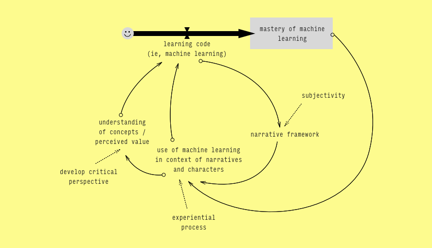

NEWMERCYPARK is an exploration into making the process of learning how to code more narrative. In this project I seek to combine the interactive aspects of widely available coding tutorials with principles of game and interaction design so as to redirect code learning into an unexplored space of theater, provocation, empathy and subjectivity.

 
